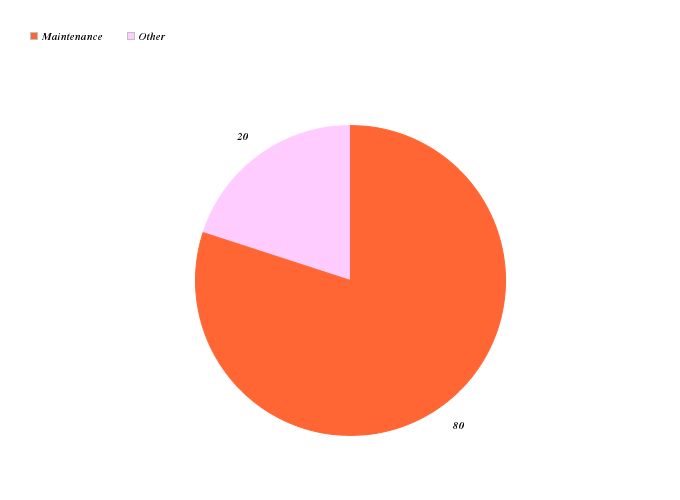
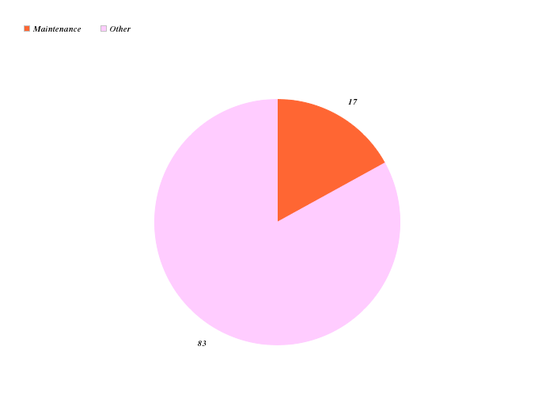
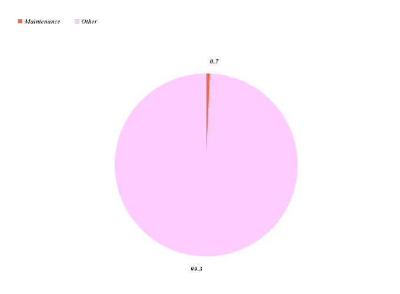
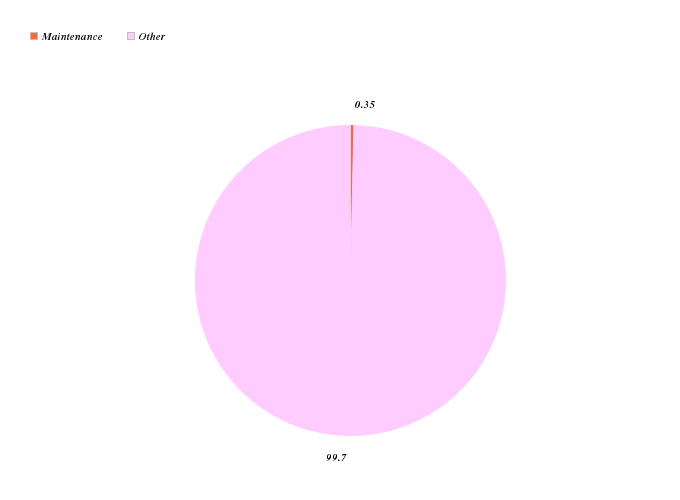

!SLIDE
# Analysis #

!SLIDE
# Applicability of SE Code #
## "by direct participation or by teaching" ##

!SLIDE
# Applicability of SE Code #
## "prepares students to become software professionals" ##

!SLIDE
# 5.06 Accurate Description #
## School vs. Employment ##

!SLIDE center

!SLIDE center

!SLIDE center

!SLIDE center

!SLIDE 
# A Software Maintenance Course #
## James Pearson ##
### aka xiong_chiamiov ###
### http://changedmy.name/csc300/ ###
### http://github.com/xiongchiamiov/csc300 ###

